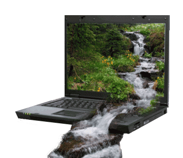

# Data Rivers, Streams, and Creeks

  

Using a JavaScript Object Notation (JSON) Application Programming Interface (API), construct a simple web-based experience based on data from an external JSON feed. Your website should gather information or content from an external source and manipulate in some way beyond simply re-posting it. A few considerations as you put together your page:

- Are there ways you use the data to manipulate elements (scale, colour, etc) in your DOM?
- Can you collect and frame content based on your own parameters?
- How do you account for variability in the content over time?
- What is a consistent element? How/When can it deviate?
- Each project should include a statement outlining what you’re doing as well as your data source.

**Resources:**
- https://newsapi.org
- https://openweathermap.org/api
- https://collection.cooperhewitt.org/api
- https://api.nasa.gov
- http://www.loc.gov/pictures/api
- https://www.mediawiki.org/wiki/API:Data_formats
- https://archive.org/help/json.php
- http://api.repo.nypl.org
- https://developer.twitter.com

Feel free to start with this example of using News API:

[example-5-data](../examples/example-5-data)

## An alternative to the above brief

Use external JS library(ies) to create a visually compelling web-poster. You are free to choose your content but know that you are being graded based on form, content, and execution. Example libraries you can include:

- http://letteringjs.com/
- http://fittextjs.com/
- http://d3js.org/
- http://animejs.com/
- https://two.js.org/

Super Interesting:

- http://paperjs.org/
- http://p5js.org/
- https://threejs.org/