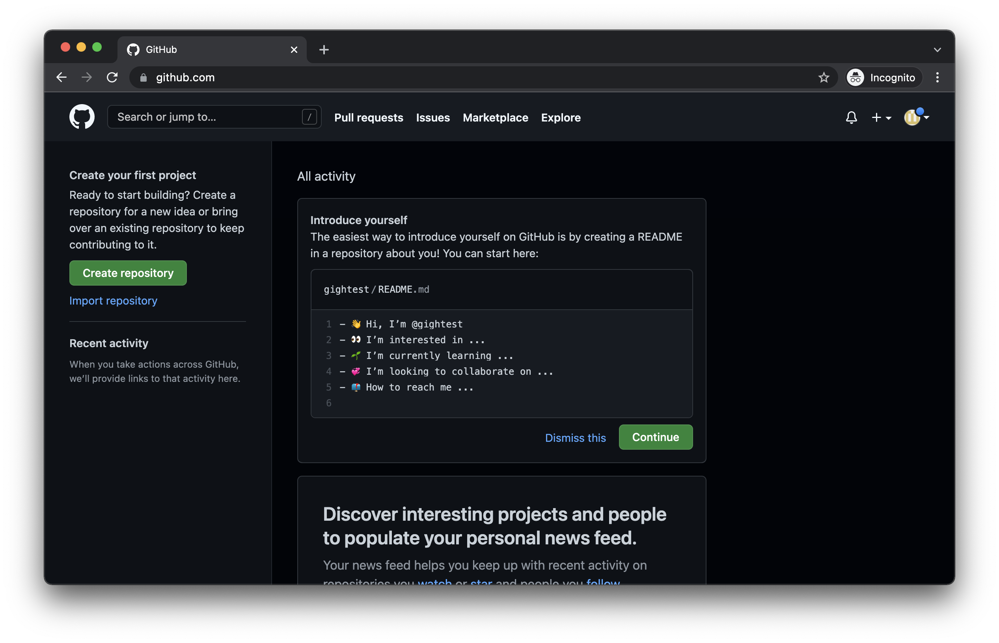
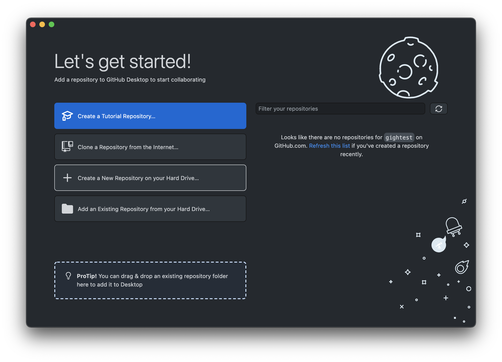

# Hosting: GitHub.com

GitHub is a provider of hosting for software development and version control using [Git](https://en.wikipedia.org/wiki/Git). There are many resources, and concepts, to understand Git. This guide will be specific in using GitHub Desktop as a method to publish a website on GitHub.

## Prerequisites
- [GitHub Desktop](https://desktop.github.com/)
- [GitHub Account](https://github.com/)

## Setup GitHub Desktop
1. Download and install [GitHub Desktop](https://desktop.github.com/) (macOS/Windows).
2. Click "Sign in to GitHub.com" on the welcome screen (This will open a browser window). From this screen you can create an account if you don't have one already. You can also step-through [Creating a GitHub account](#creating-a-github-account-if-one-was-created-as-part-of-the-steps-aboove) below.
3. Click "Authorize desktop" on the "Authorize GitHub Desktop" page.
4. Click "Open GitHub Desktop" in the resulting dialogue box.
5. Select "Use my GitHub account name and email address" on the "Configure Git" screen.
6. Click "Finish".

### Creating a GitHub account (if one was not created as part of the steps above)
1. Visit [github.com/signup](https://github.com/signup)
2. Enter your email (an email you had access to as you will need to verify the email).
3. Create a password (Make sure it's at least 15 characters OR at least 8 characters including a number and a lowercase letter).
4. Username (the username will be part of the URLs. For example: `https://username.github.io`).
5. Account creation is complete once you've verified your email and see the Activity Stream.

## Creating a Repository
1. Click "Create a New Repository on your Hard Drive..." on the "Let's get started!" screen.

2. On the "Create a New Repository" screen, fill "Name" with the following format where `GitHubUsername` is your GitHub username: `GitHubUsername.github.io`.
3. (optional) Provide a description.
4. Note the "Local Path" will be where the project folder will reside on your computer. Click "Choose" to define a new folder for your website.
5. Click "Create Repository".

## Commit/Publish to Repository
1. Add and modify files in the repository folder (will most likely be a folder named `GitHubUsername.github.io`).
2. In GitHub Desktop, you will see the new changes in the left-hand column.
3. Click "Commit to main" in the left-hand column (this will clear the left-hand column of changes).
4. Click "Publish Repository".
5. Uncheck "Keep this code private" (Public repositories are viewable to anyone accessing GitHub).
6. Click "Publish Repository" (this will change to "Push origin" as you make and publish changes).
7. Visit `https://GitHubUsername.github.io` to see your project.
8. As you make changes to files, continue to "Commit to main" the changes and "Push origin" in order to make your changes visible.