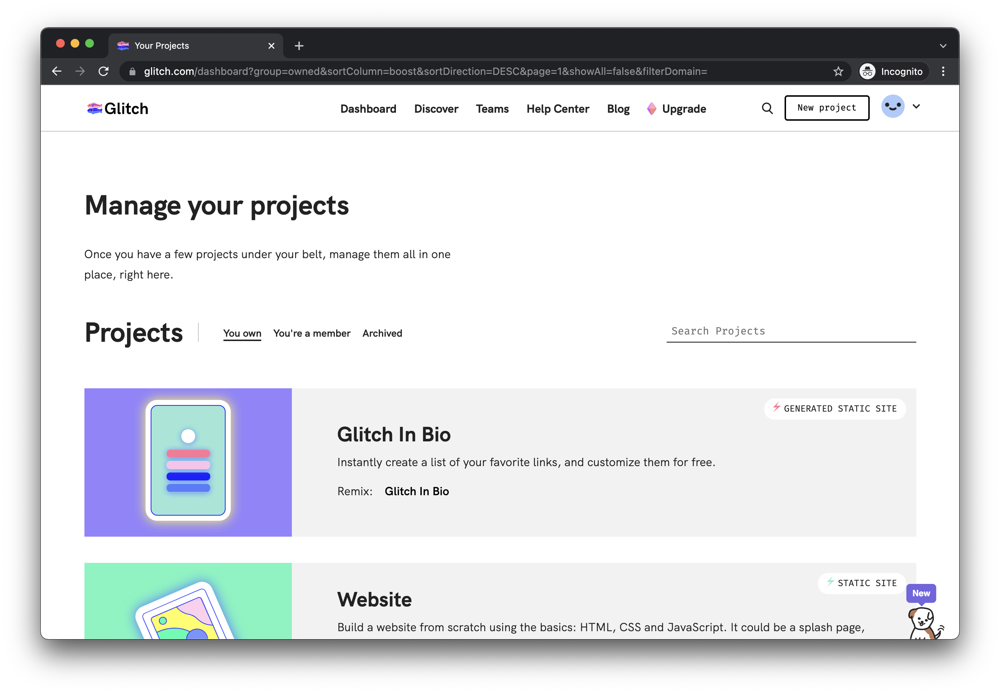
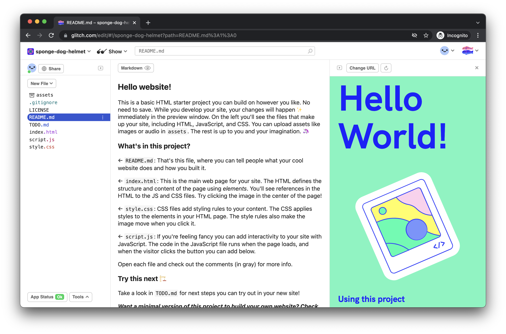
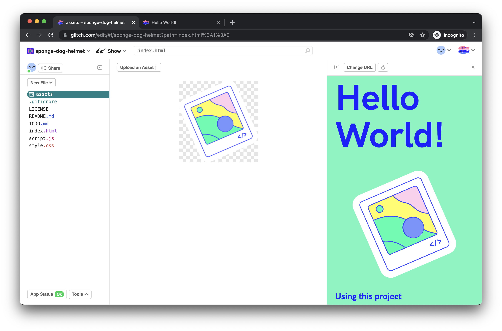
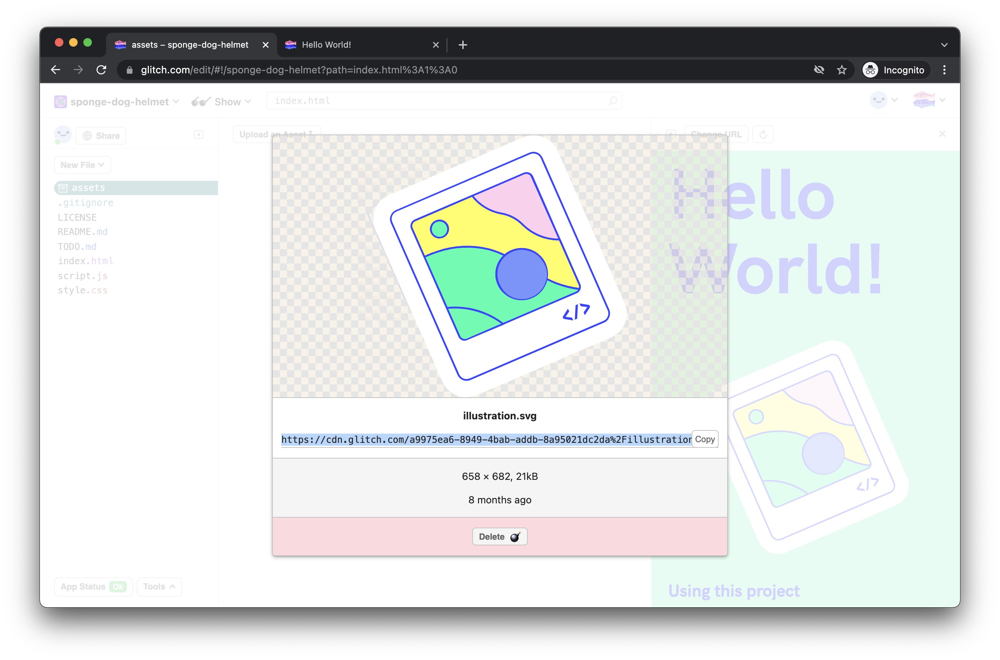

# Hosting: [Glitch.com](https://glitch.com/)

[Glitch.com](https://glitch.com/) is a web service that allows people to build, and share, simple web applications.

## Prerequisites
- Glitch.com account

## Create an account
1. Click "Sign up", in the top-right corner or visit [glitch.com/signup](https://glitch.com/signup).
2. Select a method for creating an account.
3. The Dashboard will be viewable once you've created your account.

4. From this point, you can remix an existing project, or create a new project by clicking "New project".
5. Note the name of your project in the top-left corner. The name will be part of the sub-domain to view the site outside of the editor. For example,  a project with the name `sponge-dog-helmet` can be viewed at `https://sponge-dog-helmet.glitch.me/`.

## Uploading assets
1. Assets such as images should be uploaded through the "assets" interface and linked by the generated URL.

2. Assets are files that are not `.html`, `.js`, or `.css`. Assets are usually images that are part of your project.
3. Once you've uploaded an asset click on the asset to view the resulting URL.

4. Replace any instance of the asset in your HTML, CSS, JavaScript, files with the complete URL. For example: `/images/background.jpg` should be replaced with `https://cdn.glitch.com/a9975ea6-8949-4bab-addb-8a95021dc2da%2Fbackground.jpg?v=1618177344016`.