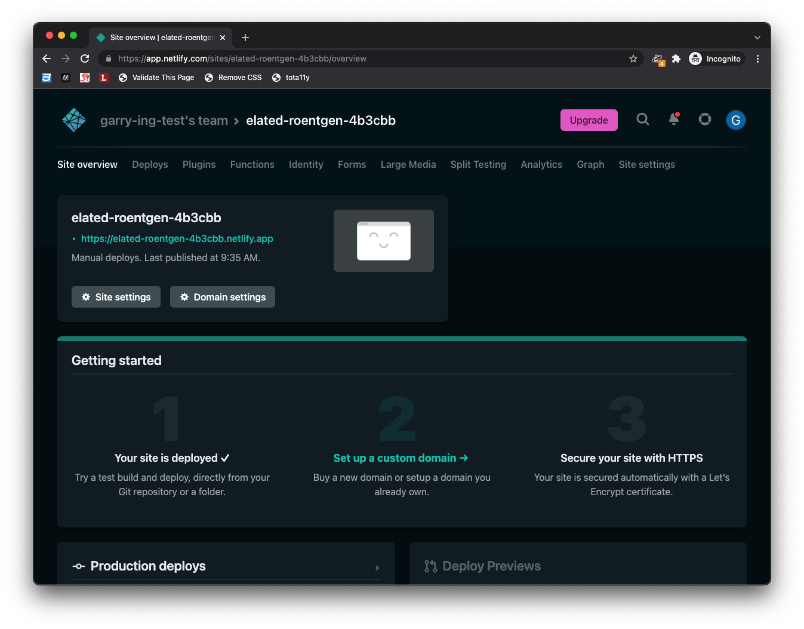
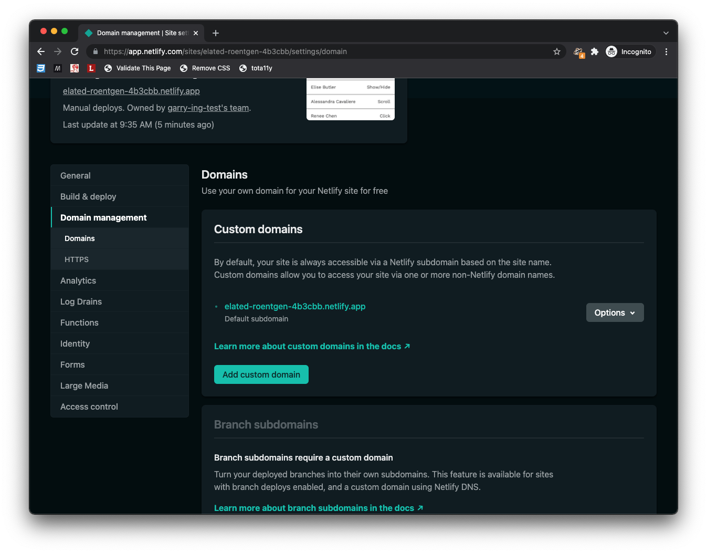
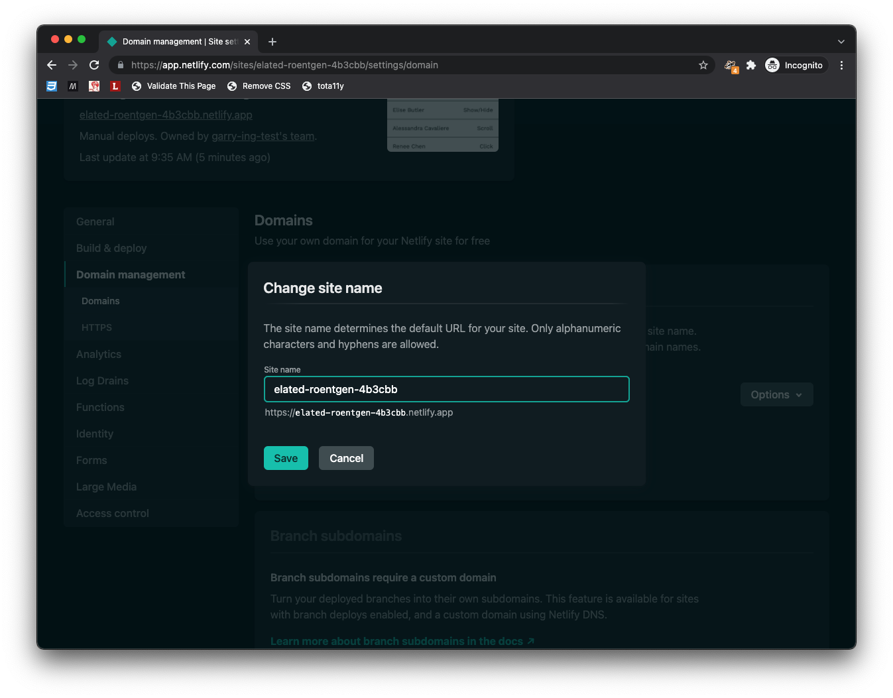
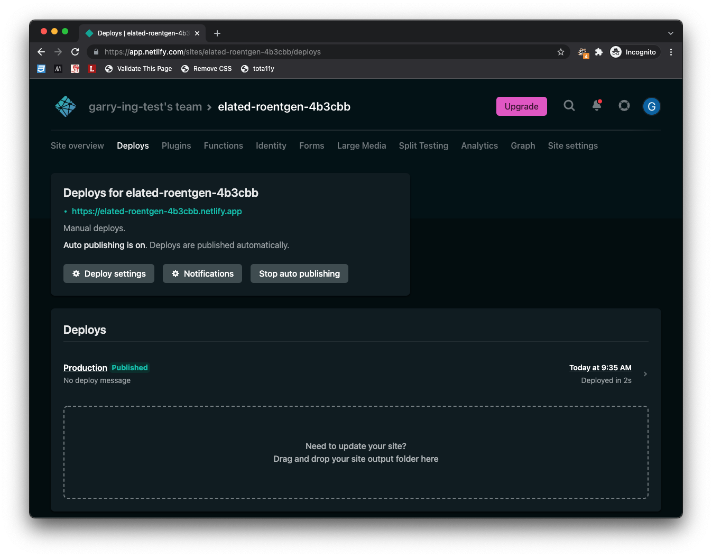

# Hosting: [Netlify](https://www.netlify.com/)

[Netlify](https://www.netlify.com/) is a platform that allows people to build web applications and static websites.

## Prerequisites
- Netlify account

## Create an account and upload your first project
1. Click "Sign up", in the top-right corner.
2. Select a method for creating an account.
3. Upon verifying your account, you will be presented with a few sign-up questions. Click "Set up and continue".
4. At "Deploy your first project", you will have the option to drag and drop your project folder.

5. Once you have dragged and dropped your project folder, you will be redirected to the "Site overview".

6. The project site will be available using the URL on the page. The URL will follow a pattern of `https://[random-name].netlify.app`.

## Change `*.netlify.app` address
1. From the "Site overview", click on "Domain settings".
2. In the "Domains" section, click on "Options", "Edit site name", on the corresponding project.

## Updating your project
1. Click on "Deploys" in the top navigation (to the right of "Site overview").
2. In the "Deploys" section, drag and drop your updated project folder.
