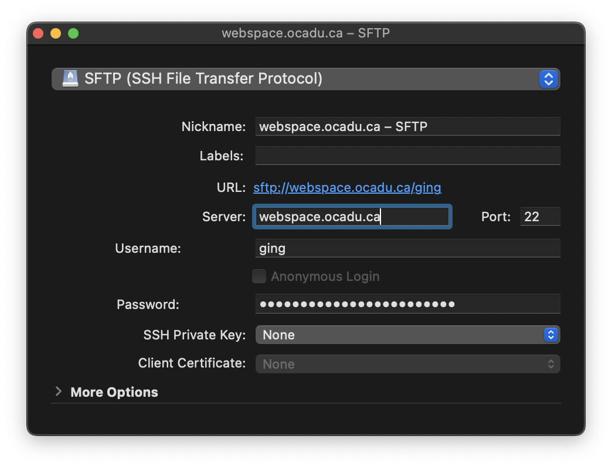
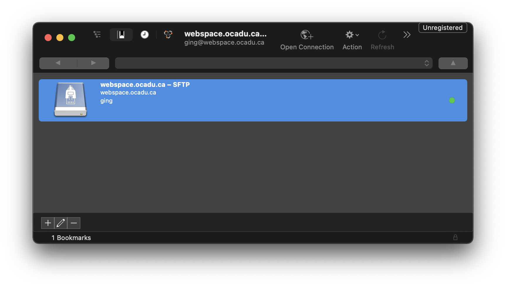
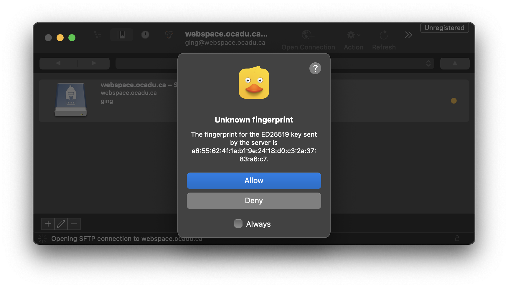
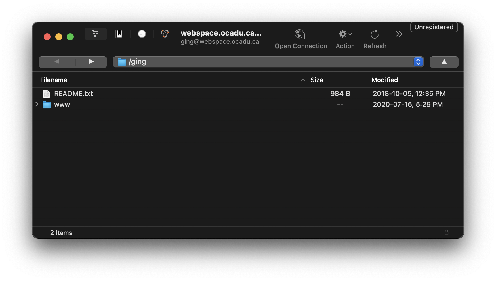
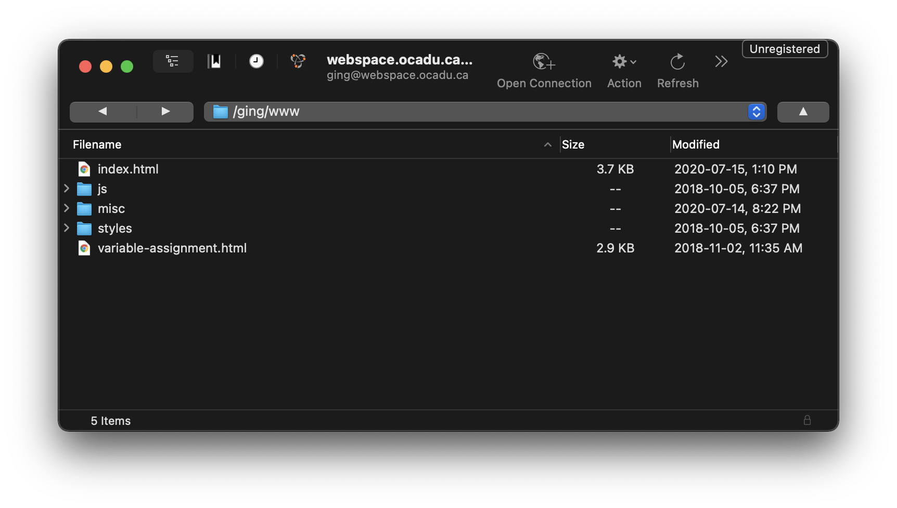

# Hosting: OCAD University Webspace

A service offered by OCAD University to host web content by uploading files to a server. Content is viewable by visiting `https://webspace.ocad.ca/~OCADUid/`.

## Prerequisites
- OCADUid and password
- (S)FTP client

## Configure (S)FTP Client
1. Download and install an (S)FTP client. There are many to choose from for all operating systems: [Cyberduck](https://cyberduck.io/), [Fetch](https://fetchsoftworks.com/).
1. The client will require the follow information in order to connect to Webspace:

    | Field | Value |
    |---|---|
    | Hostname | webspace.ocad.ca |
    | Username | Your OCADUid (eg. jdoe, doej, aa13bb, 3150001) |
    | Password | Your OCADU Password |
    | Port Number | 22 (should be the default) |
    | Protocol | SFTP (Not FTP ‐ Very Important!) |

## Example: Configuring Cyberduck
1. Click on the plus (+) icon to create a new Bookmark. A bookmark is recommended as you may be reconnecting to Webspace to update files.  Alternatively, click on "Open Connection" in the top bar.
1. Fill in the displayed fields with the information from the previous section. Changes will be automatically saved in the Bookmark. Close the Bookmark editing window.

1. Double-click on the create bookmark.

1. Click "Allow" if a dialogue box is displayed.

1. Once connected, double-click to the `www` folder.

1. Upload your files to the directory.

1. Navigate to `https://webspace.ocad.ca/~OCADUid` from a browser to view your website.
1. If you decide to host more than one project on Webspace, create multiple folders in the `www` folder and provide the folder name in the URL.
1. For example: `/OCADUid/www/project-1` will be viewable at `https://webspace.ocad.ca/~OCADUid/project-1`.